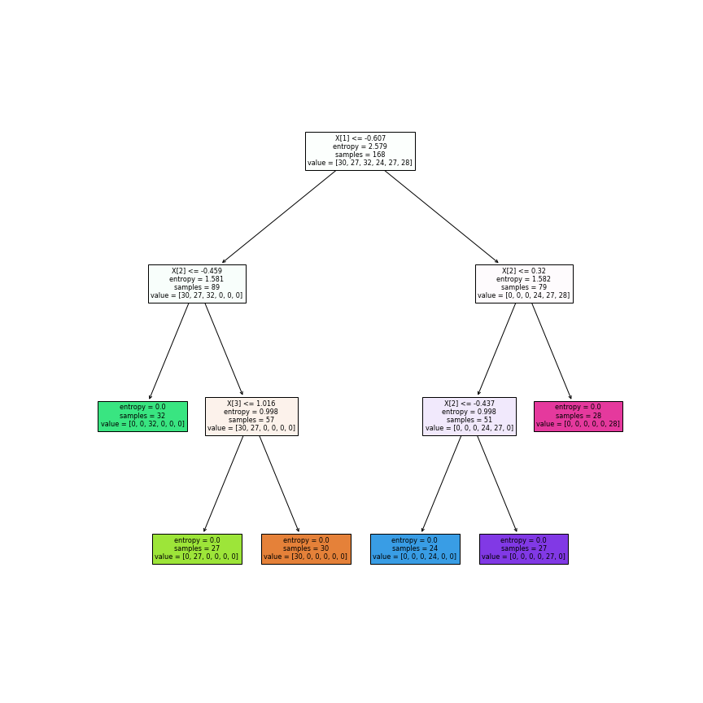
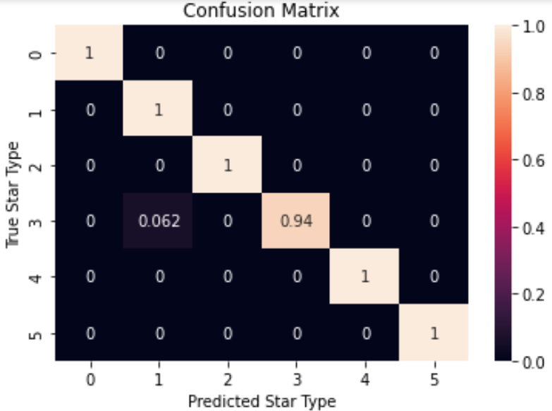

# Stars classification and prediction model

The objective of the project is to determine what type of star is being studied based on its most important characteristics, as well as to find possible hidden relationships between these characteristics that provide new knowledge in stellar astrophysics. The types of stars to be classified are the following:

	* 1. Brown dwarf.
	* 2. Red dwarf.
	* 3. White dwarf.
	* 4. Main sequence.
	* 5. Supergiant.
	* 6. Hypergiant.

## About this project

The content of this project is explained in the next lines:

* 1. Data loading and exploration: The data is loaded from a public file in Google Drive and some relations between the variables of the stars are studied in the files: [data_loading.ipynb](https://github.com/cagutierrezgu/My_Portfolio/blob/bcf56de444780898cbdbc2dfdad1a190e5d1f6c5/Stars%20classification%20and%20prediction/1.%20Data%20loading%20and%20exploration/1.%20data_loading.ipynb), [data_exploring.ipynb](https://github.com/cagutierrezgu/My_Portfolio/blob/bcf56de444780898cbdbc2dfdad1a190e5d1f6c5/Stars%20classification%20and%20prediction/1.%20Data%20loading%20and%20exploration/2.%20data_exploring.ipynb).
* 2. Model: It is trained a model with some of the features of the stars in order to predict its type.
* 3. Evaluation: The previous model is evaluated with some appropiate metrics to check its reliability.

Additional to this, there is a folder named [Python files](https://github.com/cagutierrezgu/My_Portfolio/blob/bcf56de444780898cbdbc2dfdad1a190e5d1f6c5/Stars%20classification%20and%20prediction/Python%20files) which contains all the notebooks of the previous folders, but as python files as its name says. It also includes a [main.py](https://github.com/cagutierrezgu/My_Portfolio/blob/bcf56de444780898cbdbc2dfdad1a190e5d1f6c5/Stars%20classification%20and%20prediction/Python%20files/main.py) file that can be used to insert your own star data and predict what type it is.

## Models and results

A classic decision tree model was used. The inputs of this model were the 4 most important physical characteristics of a star: 

	* Temperature.
	* Luminosity.
	* Radio.
	* Absolute magnitude.

and its output is an integer indicating the type of the predicted star, where:

	* 0. Enana marrón.
	* 1. Enana roja.
	* 2. Enana blanca
	* 3. Secuencia principal.
	* 4. Supergigante.
	* 5. Hipergigante.

The tree desicion model used was improved with a search for the best hyperparameters, so that the predictions obtained on a validation set were the best as possible. The hyperparameters worked on were the following:

	* Tree partition criteria.
	* Depth of the tree.

From the study of the best hyperparameters for the trained data set, it was obtained that the best results according to the model score in a validation set, was using the "entropy" criterion to partition the tree, and this should have a depth equal to 3.

Below is an image of the decision tree obtained with these hyperparameters:

To evaluate and test the predictive capacity of the trained model, it went through a `classification report` to know its score in different metrics for test sets. These were the results:

Besides, these results were seen graphically in a confusion matrix to see the predictive capacity in each of the star types:

## Conclusions

Some of the most important ideas and results of the project are the following:

* Based on the results obtained for the test set with the trained model, it can be stated that the model would work as a good tool to predict the type of a star knowing its temperature, luminosity, radius and absolute magnitude. This is the reason it would be ready to be deployed and used by the scientific community or anyone interested, as it has less than 2% error.
* Such high results for the scores of the metrics with which the model was evaluated could indicate a possible overfitting of the data, which could be due to the amount of data available. This could be improved by including a larger amount of data and retraining the model already analyzed.
* The implemented model considered only the numeric type variables contained in the dataframe used; however, there were two more categorical and text type features. Therefore, techniques such as `one hot encoding` could be applied to these variables, in such a way that they can be included in the built model.
* Regarding the possible origin of more data to improve the current model, there are different sources. From web pages of organizations such as NASA, the European Space Agency, among others, and also observations made directly in a suitable place, such as an astronomical observatory.
